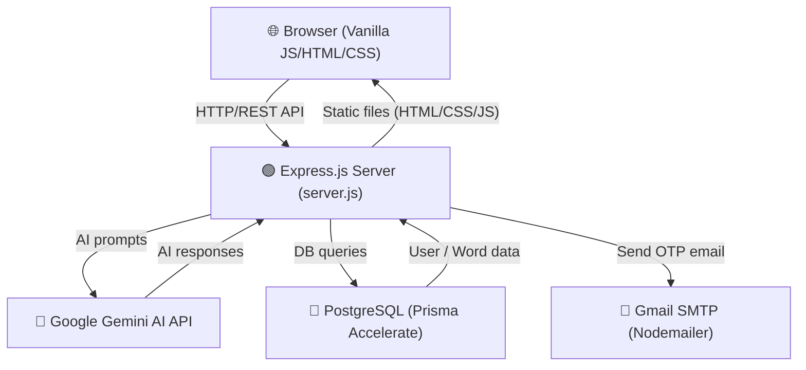
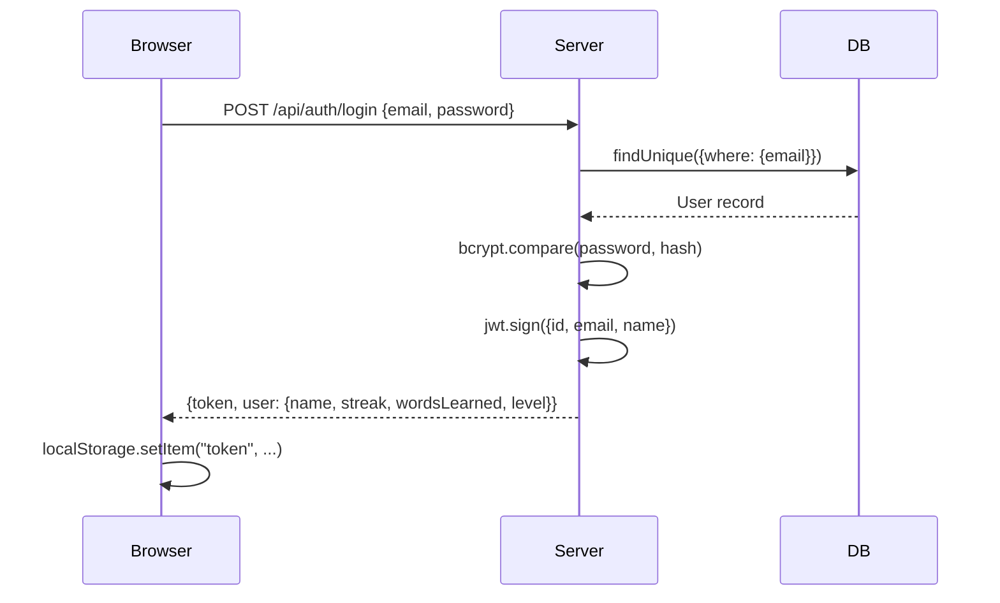
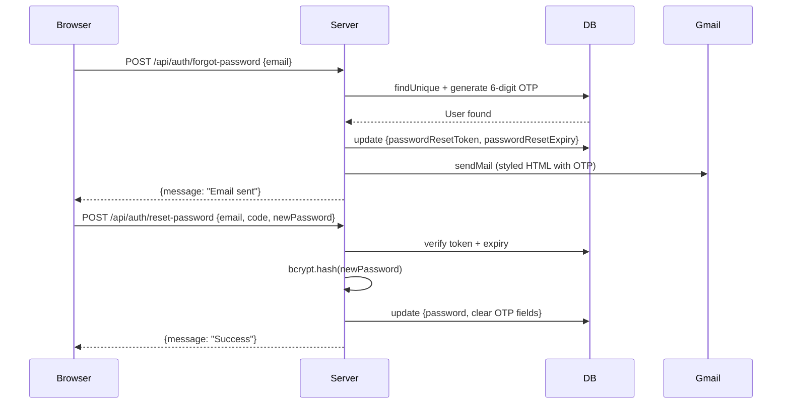
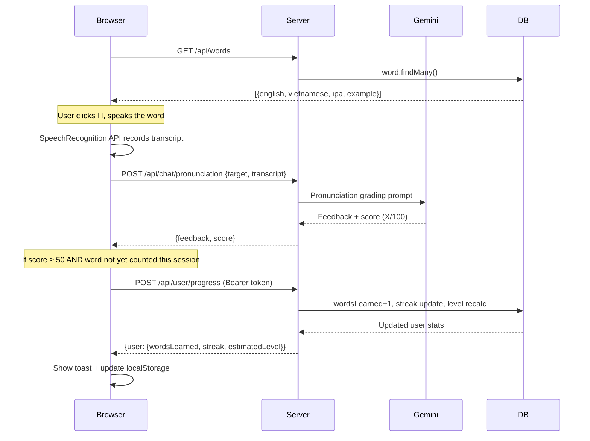

# 🏗️ Bugket — System Architecture

> A complete guide to how Bugket works, every file explained, every technology justified.

---

## 1. Big Picture — What is Bugket?

Bugket is a **full-stack English learning web app** running on a single Node.js process.
The browser sends HTTP requests → Express routes handle them → Gemini AI / PostgreSQL / Nodemailer respond → JSON is returned → Vanilla JS updates the UI.



---

## 2. Directory Structure — Explained

```
bugket/
├── server.js              ← App entry point
├── .env                   ← Secret keys (never commit!)
├── package.json           ← npm dependencies & scripts
├── vercel.json            ← Vercel deployment config
│
├── lib/                   ← Shared backend modules (no HTTP logic)
│   ├── prisma.js          ← DB client singleton
│   ├── gemini.js          ← AI client + error helper
│   ├── jwt.js             ← Token helpers + auth middleware
│   └── mailer.js          ← Email sender
│
├── routes/                ← HTTP route handlers (one file per domain)
│   ├── auth.js            ← Login, register, forgot/reset password
│   ├── user.js            ← Profile, progress tracking, rankings
│   ├── words.js           ← Vocabulary data
│   ├── chat.js            ← AI conversation + pronunciation
│   └── games.js           ← Game data (word-search words)
│
├── prisma/
│   ├── schema.prisma      ← Database models
│   └── seed.js            ← Seed 200 vocabulary words
│
├── scripts/
│   └── seed_true_words.js ← AI-powered word generation script
│
└── public/                ← Static frontend (served by Express)
    ├── styles.css         ← All CSS (dark theme design system)
    ├── logo.png           ← App logo
    ├── *.html             ← One HTML file per page
    └── js/                ← One JS file per page
```

---

## 3. Backend Files — Deep Dive

### `server.js` — The Conductor
**Tech:** Node.js, Express.js

This is the **entry point** of the app. It does only 3 things:
1. Loads `.env` variables (dotenv)
2. Mounts middleware (CORS, JSON parsing, static file serving)
3. Mounts route modules under their URL prefix

```js
app.use("/api/auth",  require("./routes/auth"));   // → /api/auth/*
app.use("/api/user",  require("./routes/user"));   // → /api/user/*
app.use("/api/words", require("./routes/words"));  // → /api/words
app.use("/api/chat",  require("./routes/chat"));   // → /api/chat/*
app.use("/api/games", require("./routes/games"));  // → /api/games/*
```

It also provides legacy aliases so old frontend code still works:
- `POST /api/pronunciation` → delegates to `/api/chat/pronunciation`
- `GET /api/conversation-topics` → delegates to `/api/chat/topics`

---

### `lib/prisma.js` — Database Client
**Tech:** Prisma ORM + PostgreSQL via Prisma Accelerate

Creates **one** PrismaClient and reuses it everywhere (singleton pattern). Without this, every `require()` would create a new DB connection, wasting resources.

```js
const prisma = new PrismaClient();
module.exports = prisma;
```

---

### `lib/gemini.js` — AI Brain
**Tech:** @google/generative-ai SDK

Initializes the Google Gemini client from your `GEMINI_API_KEY`. Also exports `detectChatError()` — a function that maps cryptic Gemini error messages into user-friendly Vietnamese error responses.

---

### `lib/jwt.js` — Auth Tokens
**Tech:** jsonwebtoken

Three exports:
| Export | What it does |
|--------|-------------|
| `signToken(payload)` | Creates a JWT that expires in 7 days |
| `verifyToken(token)` | Decodes and validates a JWT |
| `requireAuth` | Express middleware — blocks unauthenticated requests |
| `optionalAuth` | Like requireAuth but doesn't block — just sets `req.user` if valid |

---

### `lib/mailer.js` — Email Sender
**Tech:** Nodemailer + Gmail SMTP

Wraps Nodemailer's Gmail transport. You need a **Gmail App Password** (not your regular password) set in `.env`:

```
EMAIL_USER=mousecuber@gmail.com
EMAIL_PASS=your_16_char_app_password
```

> [!IMPORTANT]
> Get your App Password at: https://myaccount.google.com/apppasswords
> Gmail 2FA must be enabled first.

---

### `routes/auth.js` — Authentication
**Tech:** bcryptjs, jsonwebtoken, nodemailer

| Endpoint | What happens |
|----------|-------------|
| `POST /api/auth/register` | Validates → hash password (bcrypt, 10 rounds) → save to DB |
| `POST /api/auth/login` | Find user → compare bcrypt hash → sign JWT → return token + user |
| `POST /api/auth/forgot-password` | Generate 6-digit OTP → store in DB with 15min expiry → send email |
| `POST /api/auth/reset-password` | Verify OTP + expiry → bcrypt new password → clear OTP in DB |

**Security:** Even if the email doesn't exist, `forgot-password` always returns the same success message (prevents email enumeration attacks).

---

### `routes/user.js` — User Profile & Progress
**Tech:** Prisma, JWT middleware

| Endpoint | What happens |
|----------|-------------|
| `GET /api/user/me` | Requires auth → fetch fresh stats from DB |
| `POST /api/user/progress` | Requires auth → increment wordsLearned, update streak, recalculate level |
| `GET /api/user/rankings` | Optional auth → fetch top 10 users per category |

**Streak Logic (in `/progress`):**
```
lastLearnedAt = null     → first session → streak = 1
diffDays = 0 (same day) → streak unchanged
diffDays = 1 (next day) → streak + 1
diffDays > 1 (missed)   → streak resets to 1
```

**Level Calculation:**
| Words Learned | Level |
|--------------|-------|
| 0–29 | A1 |
| 30–59 | A2 |
| 60–99 | B1 |
| 100–149 | B2 |
| 150+ | C1 |

---

### `routes/chat.js` — AI Conversation + Pronunciation
**Tech:** Google Gemini API

**`GET /api/chat/topics`** — Returns 8 conversation topics (daily life, travel, work, etc.)

**`POST /api/chat`** — Multi-turn conversation:
1. Finds the topic by ID
2. Builds a system instruction (Vietnamese+English format, correction rules)
3. Reconstructs conversation history (alternating user/model roles — Gemini requirement)
4. Sends to Gemini → returns AI reply with `[EN]...[/EN][VI]...[/VI]` format

**`POST /api/chat/pronunciation`** — Pronunciation grading:
1. Takes `target` (the English word) and `transcript` (what the mic heard)
2. Sends to Gemini with a structured prompt
3. Parses the `X/100` score from the response
4. Returns `{ feedback, score }`

---

### `routes/words.js` — Vocabulary Data
**Tech:** Prisma

Simple: `GET /api/words?limit=N` → fetch N words from the `Word` table (max 2000, default 1000).

---

### `routes/games.js` — Game Data
**Tech:** Express (static data)

Currently returns the fixed word list for the word-search puzzle game. Can be extended as more games are added.

---

### `prisma/schema.prisma` — Database Models
**Tech:** Prisma ORM → PostgreSQL

```prisma
model User {
  id                   Int       // Auto-increment primary key
  email                String    // Unique login identifier
  password             String    // bcrypt hash (NEVER store plain text)
  name                 String    // Display name
  streak               Int       // Current daily learning streak
  wordsLearned         Int       // Total words successfully pronounced
  estimatedLevel       String    // "A1" to "C1" — auto-calculated
  lastLearnedAt        DateTime? // For streak date diff logic
  passwordResetToken   String?   // 6-digit OTP
  passwordResetExpiry  DateTime? // OTP expires in 15 min
  createdAt            DateTime  // Account creation time
}

model Word {
  id         Int     // Primary key
  english    String  // The English word (unique)
  vietnamese String  // Vietnamese translation
  level      String  // CEFR level: A1, A2, B1, B2, C1
  ipa        String? // Pronunciation guide e.g. /ˈhæpɪ/
  example    String? // Example sentence
}
```

---

## 4. Frontend Files — Deep Dive

### `public/styles.css` — Design System
**Tech:** Vanilla CSS, CSS Custom Properties, Google Fonts

This is the **single source of truth** for all visual design. Uses CSS variables (`--primary`, `--card`, `--bg`, etc.) defined in `:root` for easy theming. Key sections:
- Design tokens (colors, radii, transitions)
- Navigation styles
- Auth page glassmorphism layout
- Flashcard & pronunciation components
- Game-specific styles
- Dashboard & ranking tables
- Animations (keyframes)

> [!TIP]
> Never add inline styles for layout. Always extend `styles.css` so the design stays consistent.

---

### `public/js/auth.js` — Auth + Navbar
**Loaded on:** Every page (in `<script>` tags)

Does two things depending on which page it's on:
1. **`initNavbar()`** — Checks `localStorage` for a JWT token. If found → shows user avatar + dropdown. If not → shows "Đăng nhập" button.
2. **`initLoginForm()` / `initRegisterForm()`** — Wires up the login and register form submit handlers.

---

### `public/js/learn.js` — Vocabulary Flashcard + Pronunciation
**Loaded on:** `learn.html`

Flow:
```
Page loads → fetch /api/words → render flashcard + word list
User clicks 🎤 → SpeechRecognition API records speech
                → POST /api/chat/pronunciation → AI grades it
                → Show score + feedback
                → If score ≥ 50 → POST /api/user/progress
                              → Show toast "✅ Từ đã được ghi nhận!"
                              → Update localStorage cached user stats
```

Key feature: `learnedThisSession` Set — prevents counting the same word twice in one session.

---

### `public/js/chat.js` — AI Conversation
**Loaded on:** `chat.html`

Flow:
```
User selects topic → loads topic context
User types/speaks → POST /api/chat with full message history
                  → AI replies in [EN]...[/EN][VI]...[/VI] format
                  → Frontend parses format → renders dual-language bubble
                  → Shows 2-3 response suggestions [SUGGEST]...[/SUGGEST]
```

---

### `public/js/dashboard.js` — User Dashboard
**Loaded on:** `dashboard.html`

1. Reads cached user from `localStorage` → renders immediately (no flash)
2. Fetches fresh data from `/api/user/me` → re-renders + updates cache
3. Fetches `/api/user/rankings` → renders 3 ranking tables (words, streak, level)
4. Fetches `/api/words` → shows a preview grid of vocabulary

---

### `public/js/word-intent.js` — Vocabulary Widget
**Loaded on:** `index.html`, `learn.html`

Fetches words from `/api/words` and renders:
- A "Word of the Day" box (random word each page load)
- A scrollable vocabulary grid (first 100 words sorted by level)

---

### `public/js/animations.js` — Page Animations
**Loaded on:** Every page

- Tracks mouse position → updates CSS `--mx` / `--my` variables → background orbs follow cursor
- `IntersectionObserver` reveals elements on scroll with `.reveal` class

---

### `public/js/home.js` — Home Page
**Loaded on:** `index.html` only

Manages the ambient floating animations on the home page hero section.

---

### Game JS files
| File | Game | Mechanic |
|------|------|---------|
| `games-flappy.js` | Flappy Rocket | Canvas-based, word gates, energy system |
| `games-match.js` | Word Match | Flip cards, find English↔Vietnamese pairs |
| `games-quiz.js` | Multiple Choice | 4 options, time pressure |
| `games-unscramble.js` | Unscramble | Drag-drop letter tiles |
| `games-word-search.js` | Word Search | Grid highlight, click+drag |
| `games.js` | Games landing | Animated game cards, navigation |

---

## 5. Data Flow Examples

### 🔐 Login Flow


### 📧 Forgot Password Flow


### 📚 Learn a Word Flow


---

## 6. API Reference

### Auth
| Method | URL | Body | Response |
|--------|-----|------|----------|
| POST | `/api/auth/register` | `{email, password, name}` | `{message, user}` |
| POST | `/api/auth/login` | `{email, password}` | `{token, user}` |
| POST | `/api/auth/forgot-password` | `{email}` | `{message}` |
| POST | `/api/auth/reset-password` | `{email, code, newPassword}` | `{message}` |

### User
| Method | URL | Auth | Response |
|--------|-----|------|----------|
| GET | `/api/user/me` | Bearer required | `{user: {name, streak, wordsLearned, estimatedLevel}}` |
| POST | `/api/user/progress` | Bearer required | `{user: updated stats}` |
| GET | `/api/user/rankings` | Bearer optional | `{rankings: {words, streak, level}}` |

### Content
| Method | URL | Response |
|--------|-----|----------|
| GET | `/api/words?limit=N` | `{words: [...]}` |
| GET | `/api/chat/topics` | `{topics: [...]}` |
| POST | `/api/chat` | `{reply}` |
| POST | `/api/chat/pronunciation` | `{feedback, score}` |
| GET | `/api/games/word-search` | `{words: [...]}` |
| GET | `/api/health` | `{ok: true}` |

---

## 7. Environment Variables

| Variable | Required | Description |
|----------|----------|-------------|
| `PORT` | No (default 3000) | HTTP server port |
| `GEMINI_API_KEY` | **Yes** | Google Gemini API key |
| `GEMINI_MODEL` | No (default gemini-1.5-flash) | Model name |
| `DATABASE_URL` | **Yes** | Prisma Accelerate connection string |
| `JWT_SECRET` | **Yes** | Secret for signing JWT tokens |
| `EMAIL_USER` | For email features | Gmail address |
| `EMAIL_PASS` | For email features | Gmail App Password (16 chars) |

---

## 8. Deployment — Vercel

`vercel.json` tells Vercel to route all requests to `server.js`:

```json
{
  "version": 2,
  "builds": [{ "src": "server.js", "use": "@vercel/node" }],
  "routes": [{ "src": "/(.*)", "dest": "/server.js" }]
}
```

The `postinstall` script in `package.json` runs `prisma generate` automatically on every deploy, ensuring the Prisma client is built for the target platform.

> [!WARNING]
> Always set all env variables in the Vercel Dashboard before deploying. The app will crash on startup if `DATABASE_URL`, `JWT_SECRET`, or `GEMINI_API_KEY` are missing.

---

## 9. Technology Decisions

| Decision | Reason |
|----------|--------|
| **No React/Vue** | App is content-light; vanilla JS is faster to load and simpler to maintain |
| **Prisma Accelerate** | Direct PostgreSQL is not available on Vercel Serverless — Accelerate provides a cloud proxy |
| **bcryptjs** | Pure JS bcrypt — no native bindings needed (important for serverless) |
| **JWT in localStorage** | Simpler for SPA — `HttpOnly` cookies would need CSRF handling |
| **Gemini 1.5 Flash** | Fast response time (~1s), generous free tier, good Vietnamese comprehension |
| **Single CSS file** | Easier to maintain design consistency; no build step needed |

---

## 10. Common Commands

```bash
# Development
npm run dev                    # Start server at http://localhost:3000

# Database
npm run db:push                # Sync schema changes to DB (no migrations)
npm run db:seed                # Seed 200 vocabulary words
node scripts/seed_true_words.js  # Regenerate words via AI (takes ~2 min)

# Deployment
git push                       # Auto-deploys to Vercel (if connected)
```
