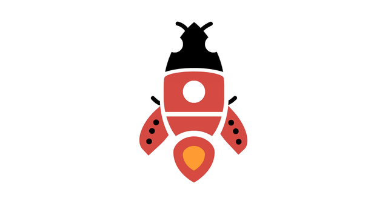

<div align="center">
  
  <h1>Bugket — AI-Powered English Learning</h1>
  <p>Practice speaking, expand your vocabulary, and master English with the help of Google Gemini AI.</p>
</div>

---

## 🌟 About Bugket

**Bugket** is a modern, gamified English learning web application designed to help users improve their language skills through interactive AI conversations, real-time pronunciation feedback, and engaging mini-games.

### ✨ Key Features

*   🤖 **AI Conversation Practice:** Chat with Google Gemini in various everyday scenarios (Travel, Work, Daily Life). The AI responds in both English and Vietnamese, providing vocabulary suggestions and grammar corrections.
*   🎙️ **Pronunciation Grading:** Speak into your microphone and get instant feedback! Bugket uses the Web Speech API and Gemini to evaluate your pronunciation, providing an IPA guide, specific improvement tips, and a score out of 100.
*   📈 **Gamified Progression:** Stay motivated with a built-in progress tracker. Bugket tracks your daily learning streak, counts the words you've mastered, and automatically estimates your CEFR proficiency level (A1 to C1).
*   🎮 **Interactive Mini-Games:** Learning shouldn't be boring. Practice your vocabulary through 5 built-in games:
    *   🚀 *Flappy Rocket* (Navigate a space rocket through correct word definitions)
    *   🃏 *Word Match* (Memory flip cards)
    *   🧩 *Word Unscramble* (Drag and drop letters to form words)
    *   📝 *Multiple Choice Quiz* (Test your knowledge under time pressure)
    *   🔍 *Word Search* (Classic grid puzzle)
*   🔒 **Secure Authentication:** Full user system featuring registration, login (JWT + bcrypt), and a secure 3-step "Forgot Password" flow via Email OTP.
*   🎨 **Premium UI/UX:** A beautifully designed dark-mode interface featuring glassmorphism, smooth animations, and a responsive layout built entirely with Vanilla CSS and JS.

---

## 🚀 Environment Setup & Installation

Follow these instructions to run Bugket on your local machine.

### 1. Prerequisites
*   [Node.js](https://nodejs.org/) (v18 or higher recommended)
*   A [Google Gemini API Key](https://aistudio.google.com/app/apikey)
*   A PostgreSQL Database (The project is pre-configured to use Prisma Accelerate, but any Postgres URL works)
*   A Gmail account with an [App Password](https://myaccount.google.com/apppasswords) (for the forgot password email feature)

### 2. Clone the Repository
```bash
git clone https://github.com/MouseCM/bugket.git
cd bugket
```

### 3. Install Dependencies
```bash
npm install
```

### 4. Configure Environment Variables
Create a `.env` file in the root directory and configure the following variables:

```env
# Server Port
PORT=3000

# AI Configuration
GEMINI_API_KEY="your_google_gemini_api_key_here"
GEMINI_MODEL="gemini-1.5-flash" # or gemini-3-flash-preview

# Database
# Note: The project currently uses Prisma Accelerate, but you can use a direct postgres:// URL
DATABASE_URL="your_postgresql_database_url_here"

# Authentication
JWT_SECRET="your_super_secret_jwt_string_here"

# Email Setup (For Forgot Password feature)
# Ensure 2-Step Verification is ON in your Google Account to generate an App Password
EMAIL_USER="your_email@gmail.com"
EMAIL_PASS="your_16_character_app_password"
```

### 5. Setup the Database
Push the Prisma schema to your database to create the necessary tables (`User` and `Word`):
```bash
npm run db:push
```

*(Optional)* Seed the database with 200 initial vocabulary words:
```bash
npm run db:seed
```

### 6. Start the Application
Run the local development server:
```bash
npm run dev
```
Open your browser and navigate to: **`http://localhost:3000`**

---

## 🏗️ Architecture Overview

Bugket is built with a clean, modular architecture without relying on heavy frontend frameworks:
*   **Frontend:** Vanilla HTML, CSS (Custom Properties, Flexbox/Grid), and Modular JavaScript.
*   **Backend:** Node.js, Express.js.
*   **Database:** PostgreSQL managed by Prisma ORM (`lib/prisma.js`).
*   **Routing:** Business logic is cleanly separated into domains (`routes/auth.js`, `routes/user.js`, `routes/chat.js`, etc.).

*(For a deep dive into every file and data flow, check out `ARCHITECTURE.md` and `agents.md` in the repository).*

---
*Built with ❤️ for English learners.*
